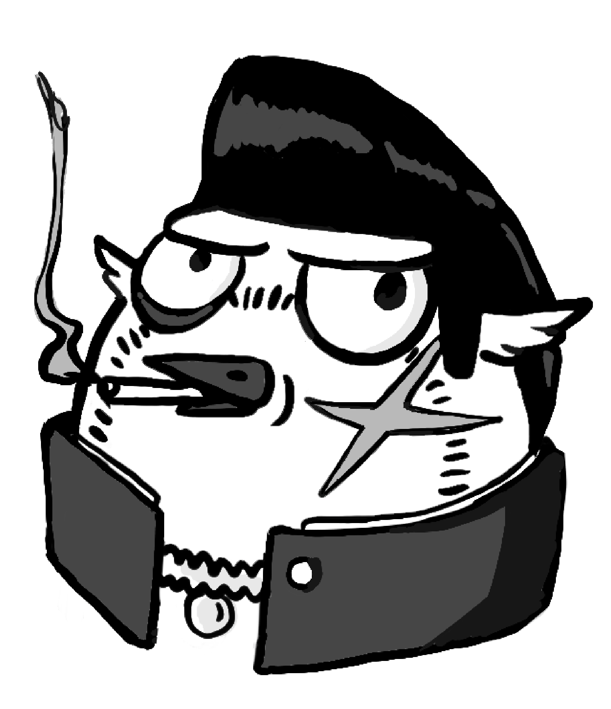

# Hool-Again
Code for the Factor game engine,  procured by the Rightful Colony of Hool

Hoo are we?  Doesn't matter kid. 

# Rules

1.  No Bacca eaters.

2.  No wool bleaters.

3.  This repo is not free,  1 mouse per download.

4.  Any mention of **The Author** will be met with due force.

5.  Hool is a no-fly zone for any of the above.

# Un-meta

This repo will end up containing the code needed to provide some sort of helpful abstraction layer over Raylib in the course of making games.  We really only need a few things to make where we're going much cleaner and smoother.  Just beware of the Owls.
